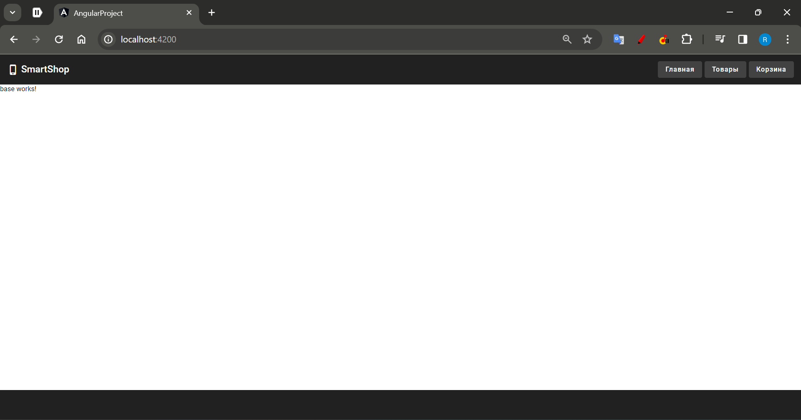
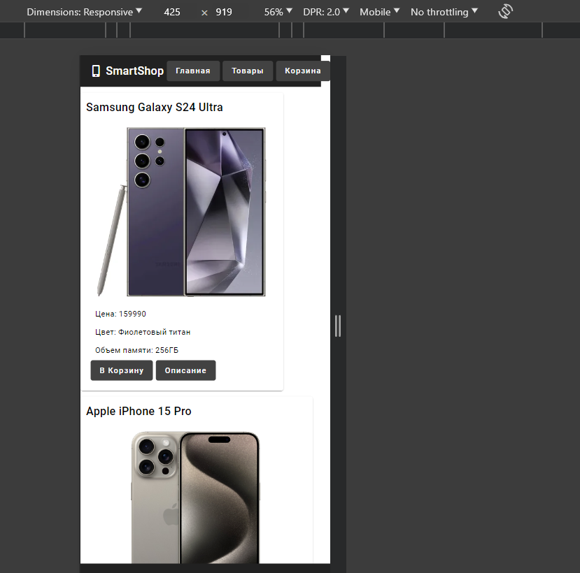

1. Главная страница - первое что видит юзер, она не должна быть пустой. Нужно отобразить хотя бы какой-нибудь текст (
   информацию о сайте, популярный товар, акции и т.д.)
2. Функционал стоил немного доработать (оформление заказа, авторизация и тп)
3. на мобилках верстка ломается 
4. С точки зрения дизайна неплохо. Нет ярких цветов (как это часто любят делать студенты), шрифты хорошие, но не хватает
   иконок, картинок, анимаций. В общем, неплохо, но  можно еще доработать.
